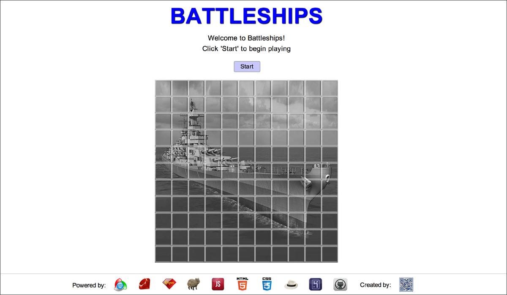
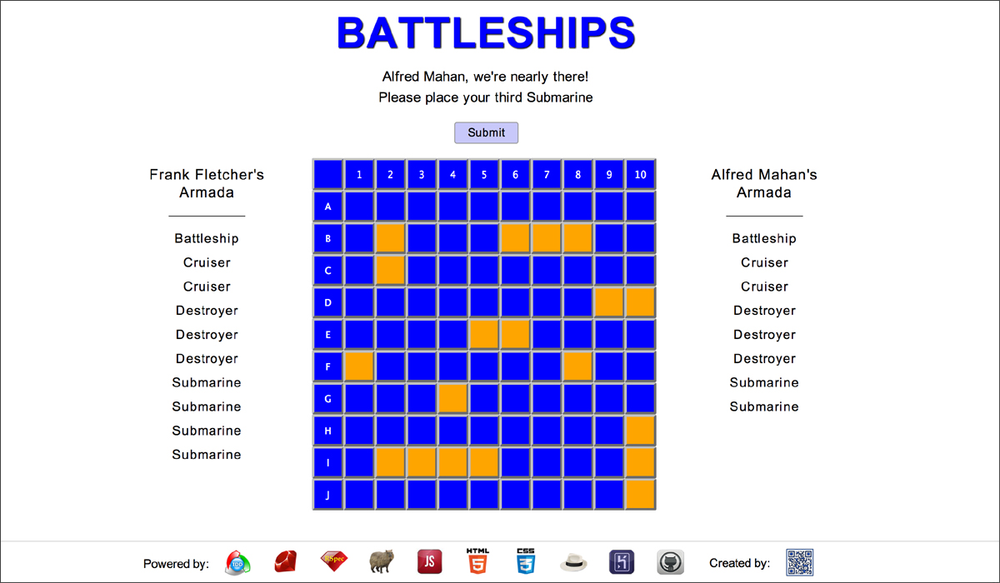
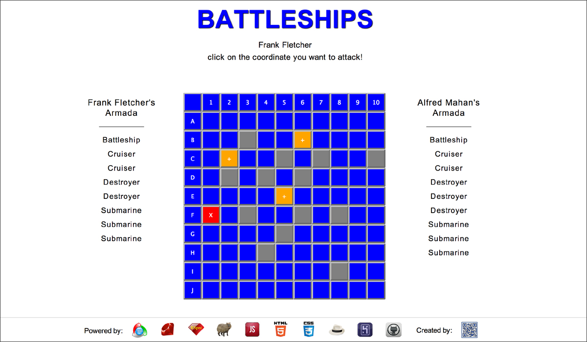
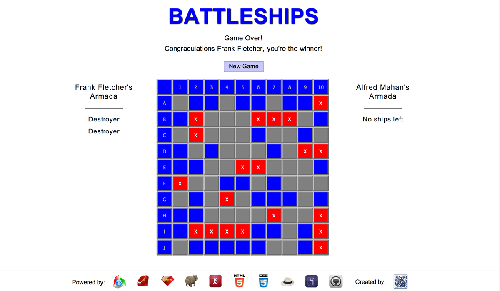

#Battleships: Web Version

## Table of Contents

* [Screenshots](#screenshots)
* [General Description](#general-description)
* [How to Play](#how-to-play)
* [See it Live on Heroku](#see-it-live-on-heroku)
* [Browsers](#browsers)
* [Testing](#testing)
* [License](#license)

##Screenshots

<table>
	<tr>
		<td align="center" width=25%>
			<a href="https://raw.githubusercontent.com/nadavmatalon/battleships_web/master/public/images/battleships_web_1.jpg">
				
				 Start
			</a>
		</td>
		<td align="center" width=25%>
			<a href="https://raw.githubusercontent.com/nadavmatalon/battleships_web/master/public/images/battleships_web_2.jpg">
				
				 Setup
			</a>
		</td>
		<td align="center" width=25%>
			<a href="https://raw.githubusercontent.com/nadavmatalon/battleships_web/master/public/images/battleships_web_3.jpg">
				
				Play
			</a>
		</td>
		<td align="center" width=25%>
			<a href="https://raw.githubusercontent.com/nadavmatalon/battleships_web/master/public/images/battleships_web_4.jpg">
				
				Winner
			</a>
		</td>
	</tr>
</table>

##General Description

The game of 'Battleships' written in Ruby & JavaScript according to TDD.

For general information please see: [Wikipedia on Battleships](http://en.wikipedia.org/wiki/Battleship_(game))

##How to Play

The goal of Battleships is to sink all of the other player's ships before
they manage to sink your own ships. 

The game begins with each player setting up their own board with 10 ships of
different kinds (and without letting the other player peak!)

The set of ships of each player consists of:

* 1 x Battleships (covers 4 squares)
* 2 x Cruisers (cover 3 squares each)
* 3 x Destroyers (covers 2 squares each)
* 4 x Submarines (cover 1 square each)

(on-screen instructions are given on how to place ships on the board)

After the boards are set, the players take turns  attacking a single 
coordinate (square) on the other player's board in each turn, so as
to try and hit the other player's ships. 

(on-screen instructions are also given on how to attack the other player's ships)

If the attack is successful the game issues a 'ship hit' message.

When all the coordinates of a given ship are hit, it sinks and the game issues a 
'ship sunk' message (it will also remove that ship from the other player's ship list
so players can keep track of how many ships each player has at any given moment).

The player who manages to sink all of the other player's ships is the winner.

##See it Live on Heroku

A live version of the app can be found at:

http://battleships-web.herokuapp.com

As I'm using Heroku's free hosting service, the app may take a bit of time to upload 
(Heroku's giros take time to wake up...), so please be patient.

##Browsers

For the best user experience, please use:

* __Mozilla Firefox__ (31.0 or later)

The app was also tested on:

* Apple Safari (7.0.5)

* Google Chrome (36.0)

However these browsers may show flickering on transitions.

##Testing

Tests were written with Rspec (3.0.4) & Capybara (2.4.1)

The tests cover both back-end logic and front-end functionality.

To run the tests in terminal: 

~~~ bash
$ rspec
~~~

##License

Released under the <a href="http://www.opensource.org/licenses/MIT">MIT license</a>.

